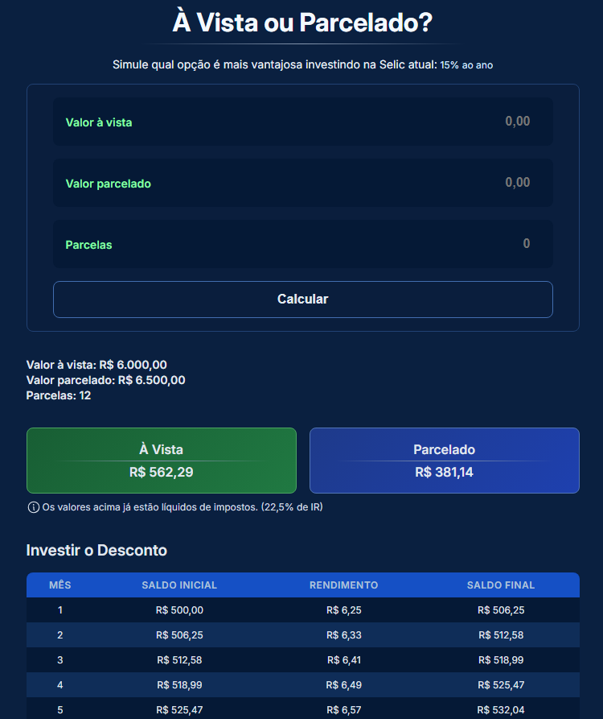

# 💰 À Vista ou Parcelado?

Aplicação web que simula qual opção é financeiramente mais vantajosa: pagar à vista e investir o desconto ou parcelar e investir o valor total.  
A simulação utiliza a taxa Selic atual, consumida diretamente da API oficial do Banco Central.

## 🚀 Funcionalidades

🔎 Consumo da API do Banco Central para obter a Selic atual  
📊 Simulação com juros compostos mês a mês  
💰 Cálculo de IR fixo de 22,5% sobre o rendimento acumulado  
📋 Geração dinâmica de tabelas detalhadas  
📱 Layout totalmente responsivo  
📈 Comparação entre dois cenários:  
- Investir o desconto (à vista)  
- Investir o valor total e sacar parcelas

## 🧠 Regras de negócio implementadas

#### Cenário A — Investir o desconto
- Calcula a diferença entre parcelado e à vista
- Aplica juros compostos mensalmente
- Aplica IR sobre o rendimento total

#### Cenário B — Investir e pagar parcelas
- Investe o valor total
- Desconta parcelas mensalmente
- Aplica rendimento sobre saldo restante
- Calcula IR apenas sobre os rendimentos acumulados

## 🛠 Tecnologias

- React  
- TypeScript  
- Styled Components  

## 📖 Conceitos aplicados

- Arquitetura baseada em separação de responsabilidades  
- Services isolados para regra de negócio  
- Tipagem com interfaces bem definidas  
- Componentização reutilizável  
- Controle de estado com React Hooks  
- Mobile First  
- Boas práticas de UX

## 🌆 Imagens do projeto

